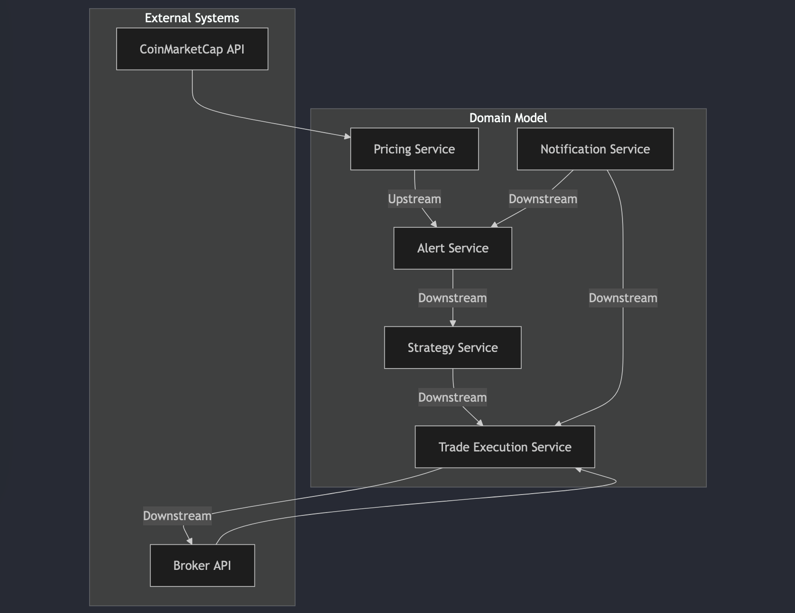

# Overview of the projet and the architecture
the following project is a trading bot that allows its users to automate trades, manage positions and to pass complex orders using a simple interface

# Architecture


## 1. Pricing Service

### Role:

- The Pricing Service is responsible for fetching real-time price data from external price aggregator APIs (e.g., CoinMarketCap, CoinGecko) at regular intervals (using a cron job).

- It doesn't perform any business logic related to trade strategy but merely provides the updated price information to downstream services.

### Events Published:

-  ```PriceUpdateEvent```: Contains the latest price for an asset, fetched from the external API.

### Event Example:
```json
{
  "eventType": "PriceUpdateEvent",
  "symbol": "BTC",
  "price": 60000,
  "timestamp": "2024-10-08T12:34:56Z"
}
```
### Events Consumed:
- None

## 2. Alert Service
### Role:
- The Alert Service listens to events to manage and evaluate alerts for predefined conditions such as:
    -   Entry price
    -   Stop-loss
    -   Take-profit
-   If a condition is met, it triggers an alert by publishing the appropriate event (e.g., for take-profit or stop-loss conditions).
-   Listens for order cancellation events to delete any alerts linked to the canceled order.

### Events Published:
- ```AlertTriggeredEvent```: Contains details of the alert triggered (entry, stop-loss, or take-profit).
### Event Example:
```json
{
  "eventType": "AlertTriggeredEvent",
  "symbol": "BTC",
  "alertType": "TAKE_PROFIT",
  "alertPrice": 64000,
  "timestamp": "2024-10-08T13:00:00Z"
}
```
### Events Consumed:
1.  **`PriceUpdateEvent`**:
    
    -   Listens for price updates to determine if any alerts should be triggered.
    -   Evaluates whether conditions like entry price, stop-loss, or take-profit have been met.
2.  **`OrderCanceledEvent`**:
    
    -   Listens for order cancellations to delete any alerts linked to the canceled order.

### Event Example (Consumed: `OrderCanceledEvent`):

```json
{
  "eventType": "OrderCanceledEvent",
  "orderId": "64f8d5e2e4b0c3044cd8271e",
  "timestamp": "2024-10-08T12:45:00Z"
}

```

-   **Action**: Deletes all alerts where `linkedOrderId` matches the `orderId` from the event.

----------

## 3. Strategy Service
### Role:
- The Strategy Service listens for events related to price changes and alerts to determine when to take action based on predefined strategies.
- If a trading condition is met (e.g., the entry price is hit), it triggers a trade by publishing a `TradeSignalEvent`.
-   Manages complex strategies like multi-take-profits and multi-stop-losses.

### Events Published:
-   ```TradeSignalEvent```: Contains the information required to execute a trade (e.g., buy/sell action, entry price, stop-loss, take-profit).
### Event Example:
```json
{
  "eventType": "TradeSignalEvent",
  "symbol": "BTC",
  "action": "BUY",
  "entryPrice": 60000,
  "stopLoss": 58000,
  "takeProfit": 64000,
  "tradeAmount": 0.5,
  "strategyId": "12345"
}
```
### Events Consumed:
- ```AlertTriggeredEvent```: Listens for alerts from the Alert Service to decide when to execute trades based on the strategy.
- ```TradeExecutedEvent```: Listens for the execution of trades to adjust the strategy or mark it as complete.

## 4. Trade Execution Service
### Role:
- The Trade Execution Service listens for trade signals (e.g., buy/sell orders) and places those orders with the broker’s API (e.g., MEXC).
- After the broker confirms the trade (either success or failure), the Trade Execution Service publishes a ```TradeExecutedEvent```.
### Events Published:
- ```TradeExecutedEvent```: Contains the result of the trade execution (e.g., success/failure, execution price, filled amount).
### Event Example:
```json
{
  "eventType": "TradeExecutedEvent",
  "symbol": "BTC",
  "executionPrice": 60000,
  "filledAmount": 0.5,
  "status": "FILLED",
  "strategyId": "12345",
  "tradeId": "67890",
  "timestamp": "2024-10-08T12:45:00Z"
}
```
### Events Consumed:
- ```TradeSignalEvent```: Listens for trade signals from the Strategy Service to place trades on the broker’s platform.

## 5. Notification Service
### Role:
- The Notification Service is responsible for sending user notifications (e.g., via email) based on events happening in the system.
- It listens to both alerts (from the Alert Service) and trade execution results (from the Trade Execution Service) to notify the user when important events occur (e.g., an alert is triggered or a trade is completed).
### Events Published:
- None (This service doesn't publish events, but rather sends notifications directly).
### Event Example:
```json
//no events
```
### Events Consumed:
- ```AlertTriggeredEvent```: Listens to alerts and notifies the user when an alert (e.g., take-profit, stop-loss) is triggered.
- ```TradeExecutedEvent```: Listens for trade executions to notify the user whether the trade was successful or failed.

# Event Orchestration Summary

- PriceUpdateEvent:
    - Published by: Pricing Service
    - Consumed by: Alert Service

- AlertTriggeredEvent:
    - Published by: Alert Service
    - Consumed by: Strategy Service, Notification Service

- TradeSignalEvent:
    - Published by: Strategy Service
    - Consumed by: Trade Execution Service

- TradeExecutedEvent:
    - Published by: Trade Execution Service
    - Consumed by: Strategy Service, Notification Service

## 5. Database Schema

### **Orders Collection**

The **Orders** collection is responsible for storing the details of orders placed by the trading system. It includes key information such as the symbol, entry price, stop-loss, take-profit, order status, and any linked alerts or trades.

#### Fields:

-   **`_id`** (ObjectId): Unique identifier for the order.
-   **`symbol`** (String): The trading pair (e.g., `BTC/USDT`).
-   **`entryPrice`** (Number): The price at which the order was placed.
-   **`stopLoss`** (Number): The stop-loss price for the order.
-   **`takeProfit`** (Number): The take-profit price for the order.
-   **`status`** (String): The current status of the order. Possible values are:
    -   **`PENDING`**: We haven't entered the trade yet
    -   **`ACTIVE`**: We entred the trade and order is still open and active.
    -   **`DONE`**: The order has hit either the Take Profit (TP) or Stop Loss (SL) and is no longer active.
    -   **`CANCELED`**: The order has been manually canceled.
-   **`createdAt`** (Date): The timestamp when the order was created.
-   **`updatedAt`** (Date): The timestamp of the most recent update to the order.
-   **`tradeAmount`** (Number): The amount of the asset being traded example (e.g., `100$` worth of BTC ).

#### Example Document:

```json
{
  "_id": "orderId123",
  "symbol": "BTC/USDT",
  "entryPrice": 92000,
  "stopLoss": 90000,
  "takeProfit": 96000,
  "status": "ACTIVE",
  "createdAt": "2024-10-08T12:00:00Z",
  "updatedAt": "2024-10-08T12:30:00Z",
  "tradeAmount": 100
}

```

### **Alerts Collection**

The **Alerts** collection is used to store price alerts set by users (in this case, without explicit user accounts, the system is using predefined conditions and notifications). Alerts can be triggered when specific price conditions are met (e.g., entry, take-profit, or stop-loss).

#### Fields:

-   **`_id`** (ObjectId): Unique identifier for the alert.
-   **`symbol`** (String): The trading pair (e.g., `BTC/USDT`).
-   **`title`** (String): Title of the alert notification.
-  **`message`** (String): Custom message associated with the alert to be sent in the notification.
-   **`linkedOrderId`** (ObjectId | null): The ID of the order linked to this alert, if possible. otherwise it's `null` if it's a just a simple notification that's not linked to a trade.
-   **`alertType`** (String): The type of alert. Possible values:
    -   **`ENTRY`**: Alert for entry price.
    -   **`TAKE_PROFIT`**: Alert for take-profit price.
    -   **`STOP_LOSS`**: Alert for stop-loss price.
    -   **`NOTIFICATION`**: Alert for notification when condition is met.
-   **`alertPrice`** (Number): The price at which the alert is triggered.
- **`triggerCondition`** (String): Possible values: "GTE" (>=), "LTE" (<=)
	-   Compare the **current price** against the `alertPrice` using the `triggerCondition`:
    
	    -   `if triggerCondition === 'GTE' and currentPrice >= targetPrice`: Trigger alert.
	    -   `if triggerCondition === 'LTE' and currentPrice <= targetPrice`: Trigger alert.
-   **`status`** (String): The status of the alert. Possible values:
    -   **`ACTIVE`**: Alert is active and waiting for a price update.
    -   **`TRIGGERED`**: Alert has been triggered based on price conditions.
    -   **`CANCELED`**: Alert was canceled before being triggered.
-   **`createdAt`** (Date): The timestamp when the alert was created.
-   **`updatedAt`** (Date): The timestamp when the alert was last updated.


#### Example Document:

```json
{
  "_id": "alertId123",
  "symbol": "BTC/USDT",
  "linkedOrderId": "orderId123"   // optional: can be null if no order is linked
  "alertType": "TAKE_PROFIT",
  "alertPrice": 64000,
  "triggerCondition": "GTE", //Possible values: “GTE” (>=), “LTE” (<=)
  "status": "ACTIVE",
  "title": "BTC Take Profit Alert",
  "message": "Take profit for BTC/USDT at 64000",
  "createdAt": "2024-10-08T12:00:00Z",
  "updatedAt": "2024-10-08T12:30:00Z",
}

```
